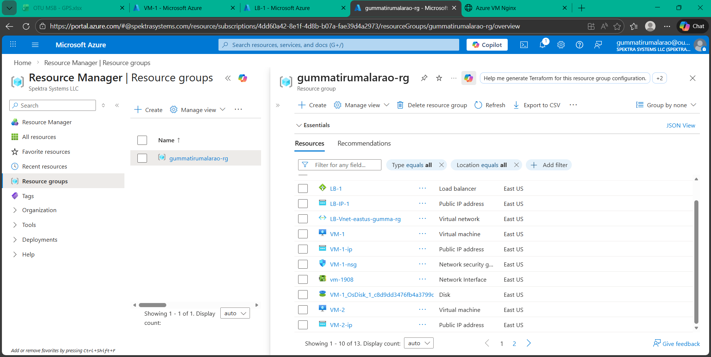
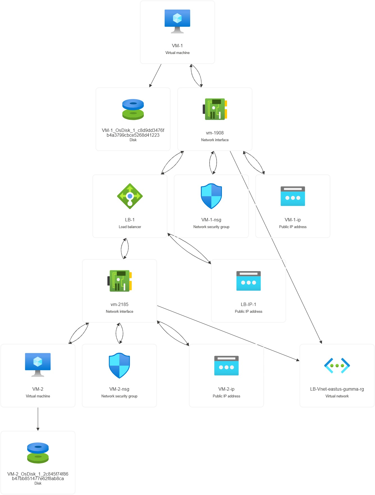
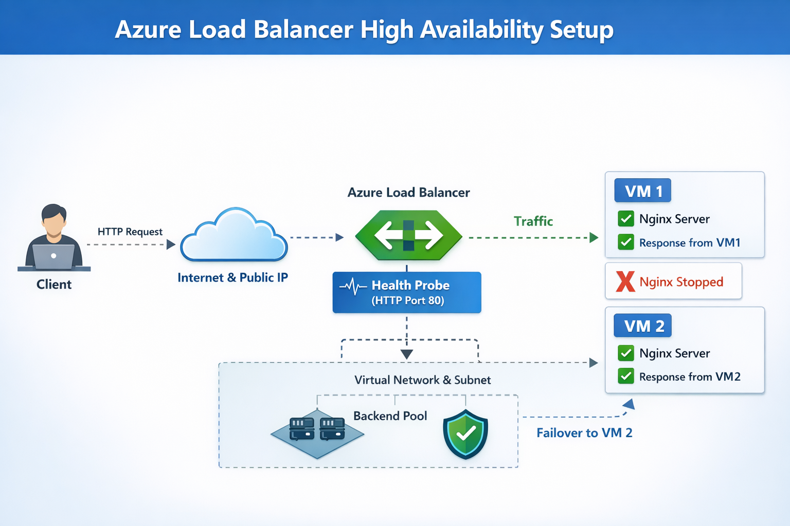
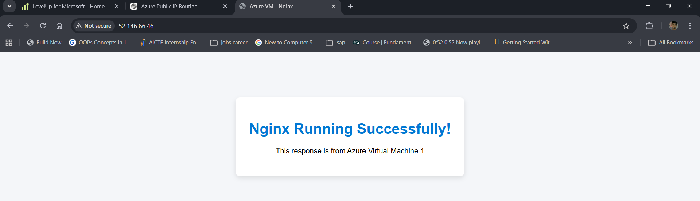
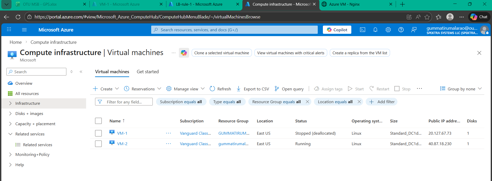
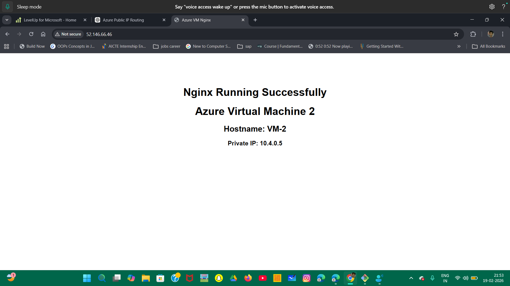

# Azure Load Balancer High Availability Lab

## 📌 Overview

This lab demonstrates how Azure Load Balancer distributes traffic between two backend Linux Virtual Machines running Nginx web servers and performs automatic failover using Health Probes.

The setup includes:


- Virtual Network (VNet)
- Subnet
- Network Security Group (NSG)
- Public IP (Standard SKU)
- Azure Public Load Balancer
- Backend Pool (2 VMs)
- Health Probe (HTTP - Port 80)
- Load Balancing Rule
- Two Ubuntu Virtual Machines with Nginx

Traffic initially routes to the first VM. When the Nginx service on the first VM is stopped, traffic automatically shifts to the second VM.



---

# 🏗️ Architecture

Client  
   ↓  
Public IP  
   ↓  
Azure Load Balancer  
   ↓  
Backend Pool (VM1 + VM2)  
   ↓  
Nginx Web Servers  

---



# ⚙️ Implementation Steps

## Step 1: Create Virtual Network

- Address Space: 10.0.0.0/16
- Subnet: 10.0.1.0/24

Both VMs and Load Balancer are deployed in this VNet and subnet.

---

## Step 2: Create Network Security Group

Inbound Security Rules:

| Name       | Port | Protocol | Action |
|------------|------|----------|--------|
| Allow-SSH  | 22   | TCP      | Allow  |
| Allow-HTTP | 80   | TCP      | Allow  |

Attach NSG to subnet or NIC.

---

## Step 3: Create Public IP

- SKU: Standard
- Assignment: Static
- Routing Preference: Microsoft Network

This Public IP will be attached to the Load Balancer frontend.

---

## Step 4: Create Azure Load Balancer

- Type: Public
- SKU: Standard
- Frontend IP Configuration: Associate Public IP
- Backend Pool: Add NICs of VM1 and VM2

---

## Step 5: Configure Health Probe

- Protocol: HTTP
- Port: 80
- Request Path: /
- Interval: 5 seconds
- Unhealthy Threshold: 2

Health Probe checks if Nginx is responding on port 80.

If probe fails, VM is removed from backend pool.

---

## Step 6: Configure Load Balancing Rule

- Frontend Port: 80
- Backend Port: 80
- Protocol: TCP
- Associate Health Probe

This rule forwards traffic from Load Balancer Public IP to backend VMs.

---

## Step 7: Create Two Ubuntu Virtual Machines

Configuration:

- OS: Ubuntu
- Size: Standard_B1s (example)
- Same VNet and Subnet
- Attach NSG
- Add NIC to Load Balancer Backend Pool

---


# 🖥️ Install and Configure Nginx on Both VMs

SSH into VM1:

```bash
sudo apt update -y
sudo apt install nginx -y
echo "Response from VM1" | sudo tee /var/www/html/index.html
sudo systemctl restart nginx
```

SSH into VM2:

```bash 
sudo apt update -y
sudo apt install nginx -y
echo "Response from VM2" | sudo tee /var/www/html/index.html
sudo systemctl restart nginx
```
# Testing Traffic Routing

Open browser:

- http://<LoadBalancer-Public-IP>


Initially:

- Traffic routes to VM1
- Refreshing may alternate depending on load balancing distribution



---

## Failover Test (Stop Nginx on VM1)

On VM1:

```bash 
sudo systemctl stop nginx
```

Wait 15–30 seconds.


### Result:

1. Health probe fails for VM1

2. Load Balancer marks VM1 as unhealthy

3. Traffic automatically routes to VM2

4. Browser shows: Response from VM2



5. Restore service:

```bash 
sudo systemctl start nginx
```
## CPU Stress Testing

Install stress tool:

```bash 
sudo apt install stress -y
```

Run:

```bash 
stress --cpu 4 --timeout 120
```

# Important:

- Azure Load Balancer does NOT shift traffic based on CPU usage.

- Traffic only shifts when:

- Health probe fails

- Application port (80) is not responding

- Therefore, CPU stress alone will not trigger failover unless Nginx becomes unresponsive.

# Key Concepts Learned

- Azure Load Balancer operates at Layer 4 (TCP/UDP).

Health Probe determines backend availability.

- Traffic routing depends on probe health, not CPU utilization.

- Stopping application service triggers failover.

- Standard Load Balancer requires NSG rules to allow traffic.

# Final Result

Two backend Ubuntu VMs configured.

Nginx web servers running.

Public Load Balancer configured.

Health Probe enabled.

Automatic failover verified.

High availability architecture successfully implemented.