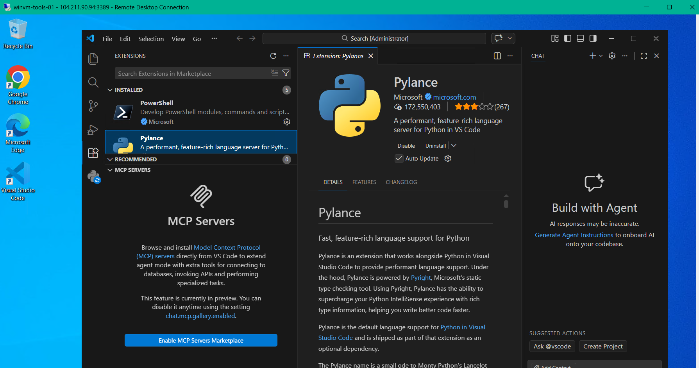

# Azure Windows VM with LogOn Automation Task

## 📌 Overview

This comprehensive task demonstrates **enterprise-grade VM provisioning and automation** using **Azure ARM Templates**, **Custom Script Extensions**, and **Azure Storage Account integration**. The solution implements an automated setup process that triggers upon user logon (RDP) to install development tools and web servers without manual intervention.

---

## 🎯 Objective

Design and deploy a **Windows Server VM** with:
- **Infrastructure as Code** using ARM templates
- **Secure script hosting** in Azure Storage Account
- **Custom provisioning** via Custom Script Extension
- **Automated logon tasks** that execute when users RDP into the VM
- **Development environment setup** with IIS, VS Code, Python extensions, and custom HTML

---

## 🏗️ Architecture Overview

```
┌─────────────────────────────────────────────────────────────┐
│                    Azure Subscription                        │
├─────────────────────────────────────────────────────────────┤
│                                                               │
│  ┌──────────────────────┐      ┌──────────────────────┐     │
│  │  Storage Account     │      │   Resource Group     │     │
│  │  (Azure Blob)        │      │   (Central India)    │     │
│  │  ┌────────────────┐  │      │                      │     │
│  │  │ script1.ps1    │──┼──────┤  Windows VM          │     │
│  │  │ logon-script   │  │      │  ┌────────────────┐  │     │
│  │  └────────────────┘  │      │  │ IIS WebServer  │  │     │
│  └──────────────────────┘      │  │ VS Code        │  │     │
│                                │  │ Python Ext.    │  │     │
│   ┌──────────────────────┐     │  │ Custom HTML    │  │     │
│   │   ARM Template       │     │  └────────────────┘  │     │
│   │ (vm.json)            │     │  ┌────────────────┐  │     │
│   │ Parameters:          │     │  │ NSG (RDP)      │  │     │
│   │ - vmName             │     │  │ Public IP      │  │     │
│   │ - adminUsername      │     │  │ VNet/Subnet    │  │     │
│   │ - adminPassword      │     │  │ NIC            │  │     │
│   │ - location           │     │  └────────────────┘  │     │
│   └──────────────────────┘     │                      │     │
│           │                    └──────────────────────┘     │
│           └─────────────────────────┬────────────────────┘  │
│                                     │                        │
└─────────────────────────────────────┼────────────────────────┘
                                      │
                          Custom Script Extension
                          (Downloads script1.ps1)
                                      │
                          ┌───────────────────────┐
                          │  Execution Flow:      │
                          │  1. Install IIS       │
                          │  2. Deploy HTML       │
                          │  3. Install Chrome    │
                          │  4. Install VS Code   │
                          │  5. Install Ext.      │
                          │  6. Create LogOn Task │
                          └───────────────────────┘
```

---

## 📋 Task Components

### 1. **Azure Storage Account**
- **Purpose:** Secure hosting of provisioning scripts
- **Container:** `log-script-windows`
- **Files stored:**
  - `script1.ps1` → Main provisioning script
  - `storage-parameters.json` → Storage configuration
- **Access:** URL-based retrieval via Custom Script Extension
- **Blob URI:** `https://{storageAccount}.blob.core.windows.net/log-script-windows/script1.ps1`

### 2. **ARM Template** (`vm.json`)
- **Type:** Resource Group Deployment
- **Resources Deployed:**
  - Network Security Group (NSG) with RDP rule (port 3389)
  - Virtual Network (VNet) - Address space: `10.0.0.0/16`
  - Subnet - `10.0.0.0/24`
  - Public IP Address (Static)
  - Network Interface Card (NIC)
  - Virtual Machine (Windows Server 2022 Datacenter)
  - Custom Script Extension

### 3. **Custom Scripts**

#### **script1.ps1** (Main Provisioning Script)
```powershell
# Sets TLS 1.2 for secure downloads
[Net.ServicePointManager]::SecurityProtocol = [Net.SecurityProtocolType]::Tls12

# Install Chocolatey package manager
Invoke-Expression ((New-Object System.Net.WebClient).DownloadString('https://community.chocolatey.org/install.ps1'))

# Install Google Chrome and VS Code
choco install googlechrome vscode -y

# Create extension installation script
# (Extensions installed in user context via scheduled task)

# Create RunOnce registry entry to install VS Code extensions at logon
```

#### **logon-script.ps1** (Automated LogOn Task)
- **Trigger:** Executes when user logs on (RDP)
- **Tasks:**
  1. Install IIS Web Server with Management Tools
  2. Deploy custom HTML file to `C:\inetpub\wwwroot\index.html`
  3. Install Google Chrome (silent)
  4. Install VS Code (silent)
  5. Install VS Code extensions:
     - `ms-python.python` (Python support)
     - `ms-vscode.powershell` (PowerShell scripting)
     - `ms-azuretools.vscode-docker` (Docker support)
     - `eamodio.gitlens` (Git integration)
  6. Create scheduled task for persistent setup automation

### 4. **Parameters File** (`vm-parameters.json`)
```json
{
  "parameters": {
    "location": { "value": "centralindia" },
    "vmName": { "value": "winvm-tools-01" },
    "adminUsername": { "value": "azureadmin" },
    "adminPassword": { "value": "Password@1234" }
  }
}
```

---

## 🔄 Deployment Flow

### **Step 1: Upload Scripts to Storage Account**
```bash
az storage blob upload \
  --account-name {storageAccountName} \
  --container-name log-script-windows \
  --name script1.ps1 \
  --file ./script1.ps1 \
  --auth-mode login
```

### **Step 2: Deploy ARM Template**
```bash
az deployment group create \
  --resource-group {resourceGroupName} \
  --template-file vm.json \
  --parameters @vm-parameters.json
```

### **Step 3: Custom Script Extension Execution**
The ARM template's Custom Script Extension:
1. Downloads `script1.ps1` from Storage Account URL
2. Executes with unrestricted execution policy
3. Installs all required software
4. Creates logon scheduled task

### **Step 4: User LogOn (RDP)**
When user RDP's into VM:
1. OS runs `logon-script.ps1` via scheduled task
2. Installs IIS and deploys custom HTML
3. Downloads and installs Chrome & VS Code
4. Configures VS Code extensions
5. Development environment ready

---

## 🎨 Custom HTML Page

**Location:** `C:\inetpub\wwwroot\index.html`

**Features:**
- Azure-themed design with gradient background
- Displays deployment summary
- Lists installed components
- Shows task agenda (Infrastructure as Code, ARM templates, SAS access)
- Responsive layout

**Accessible via:** `http://{publicIP}` (after IIS installation)

## Result of LogOn script where it installed the VScode and python extension inside it


---

## 🔐 Security & Best Practices

### **Security Measures**
✅ **Network Level:**
- NSG rules restrict inbound traffic (only RDP allowed initially)
- Static Public IP for consistent access

✅ **Script Execution:**
- Scripts stored in secure Azure Storage Account
- Blob access via authentication
- PowerShell execution policy configured appropriately

✅ **Credentials:**
- Admin credentials provided via secure parameters
- Passwords marked as `secureString` in ARM template

### **Best Practices Implemented**
✅ **Infrastructure as Code (IaC):**
- Complete infrastructure defined in ARM template
- Separated parameters for reusability
- Dependency management via `dependsOn`

✅ **Automation:**
- Zero-touch deployment
- Scheduled tasks for logon automation
- Custom script extension for provisioning

✅ **Scalability:**
- Template reusable for multiple deployments
- Parameterized for environment variations

---

## 📊 Resource Configuration Summary

| Component | Configuration |
|-----------|---|
| **VM Name** | winvm-tools-01 |
| **OS** | Windows Server 2022 Datacenter |
| **VM Size** | Standard_B2as_v2 |
| **Region** | Central India |
| **VNet** | vnet-india (10.0.0.0/16) |
| **Subnet** | default (10.0.0.0/24) |
| **Public IP** | Static allocation |
| **NSG Rules** | Allow RDP (port 3389) |
| **Storage Account** | Azure Blob Storage |

---

## ✅ Verification Steps

### **1. VM Deployment Verification**
```powershell
# Check VM status
az vm get-instance-view \
  --resource-group {resourceGroupName} \
  --name winvm-tools-01 \
  --query instanceView.statuses[?starts_with(code, 'PowerState/')].displayStatus
```

### **2. RDP Connection**
```bash
# Get public IP
az vm show-ip-address \
  --resource-group {resourceGroupName} \
  --name winvm-tools-01
  
# Connect via RDP
mstsc /v:{publicIP}
```

### **3. IIS Verification**
- Open browser: `http://{publicIP}`
- Verify custom HTML page loads
- Check IIS Manager: Services → IIS

### **4. VS Code & Extensions Verification**
- Launch VS Code from Start menu
- Check Extensions tab: Python, PowerShell, Docker, GitLens installed
- Verify extension functionality

### **5. Script Execution Logs**
```powershell
# Check scheduled task
Get-ScheduledTask -TaskName "DevEnvironmentSetup"

# View execution history
Get-WinEvent -LogName "Windows PowerShell" | Where-Object {$_.Message -like "*DevEnvironmentSetup*"}

# Check setup log
Get-Content C:\dev-setup-log.txt
```

---

## 🎓 Key Learnings

### **ARM Template Power**
- ✅ Full infrastructure provisioning in single deployment
- ✅ Parameter-driven configurations
- ✅ Dependency management and orchestration
- ✅ Repeatable, consistent deployments

### **Custom Script Extensions**
- ✅ Powerful post-deployment automation
- ✅ Script hosted securely in Storage Account
- ✅ Flexible execution (PowerShell, Bash, etc.)
- ✅ Integration with existing configurations

### **Scheduled Tasks**
- ✅ Logon triggers for user-specific tasks
- ✅ Persistent automation across reboots
- ✅ User context vs. System context execution
- ✅ Registry-based task configuration

### **Azure Storage Integration**
- ✅ Secure script hosting and distribution
- ✅ Versioning and backup capabilities
- ✅ SAS tokens for granular access control
- ✅ Cost-effective centralized storage

### **Development Tool Automation**
- ✅ Silent installation via Chocolatey
- ✅ VS Code extension installation via CLI
- ✅ Custom configurations via scripts
- ✅ Reproducible developer environments

---

## 🚀 Future Enhancements

1. **Managed Identity Integration**
   - Use Azure Managed Identity for Storage Account access
   - Eliminate credential requirements
   - Enhanced security posture

2. **Infrastructure Monitoring**
   - Azure Monitor for VM metrics
   - Application Insights for IIS logging
   - Alert rules for performance anomalies

3. **Configuration Management**
   - Azure Automation DSC for continuous compliance
   - Policy-based enforcement
   - Configuration drift detection

4. **Multi-Environment Support**
   - Dev, Test, Production parameter sets
   - Environment-specific configurations
   - CI/CD pipeline integration

5. **Cost Optimization**
   - Auto-shutdown policies
   - Reserved instances for production
   - Hybrid Benefit leverage

---

## 📝 Files Involved

| File | Purpose |
|-----|---------|
| `vm.json` | ARM template with all resources |
| `vm-parameters.json` | Deployment parameters |
| `script1.ps1` | Provisioning script (Chocolatey, apps) |
| `logon-script.ps1` | LogOn task script (IIS, HTML, extensions) |
| `storage.json` | Storage account ARM template |
| `storage-parameters.json` | Storage account parameters |
| `LogOn.md` | This documentation |

---

## 🔗 Related Resources

- [Azure ARM Template Reference](https://learn.microsoft.com/en-us/azure/templates/)
- [Custom Script Extension Documentation](https://learn.microsoft.com/en-us/azure/virtual-machines/extensions/custom-script-windows)
- [Azure Storage Account Overview](https://learn.microsoft.com/en-us/azure/storage/common/storage-account-overview)
- [Windows Scheduled Tasks via PowerShell](https://learn.microsoft.com/en-us/powershell/module/scheduledtasks/)

---

## ✨ Conclusion

This task demonstrates a **production-ready approach** to Azure infrastructure automation. By combining **ARM templates, storage accounts, and scheduled tasks**, we achieved:

✅ **Fully automated VM provisioning**  
✅ **Zero-touch deployment setup**  
✅ **Secure script distribution**  
✅ **User-context automation**  
✅ **Reproducible environments**  
✅ **Enterprise best practices**

The solution scales effortlessly and provides a foundation for more complex deployments with monitoring, compliance, and disaster recovery capabilities.

---

**Date:** February 22, 2026  
**Author:** Tirumala Rao  
**Status:** Completed ✅
